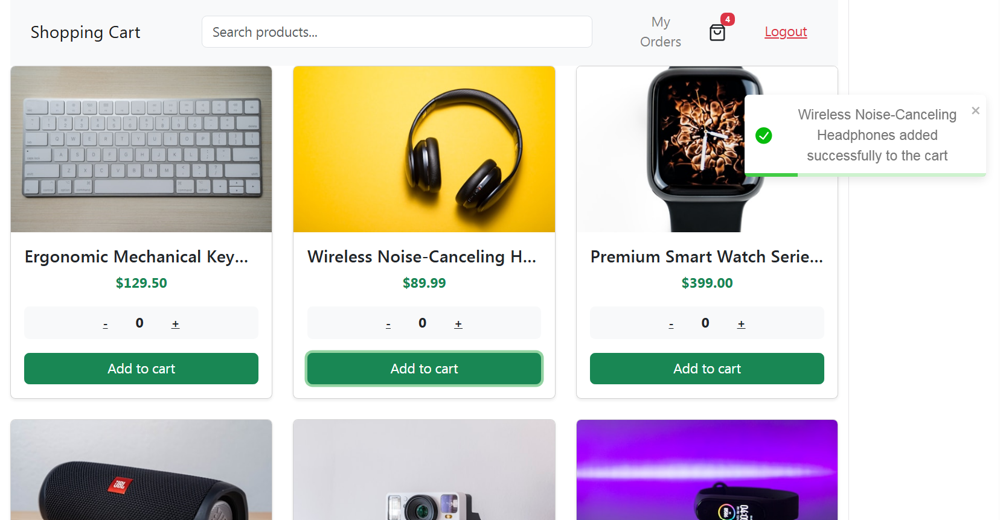

# 🛒 Full-Stack E-Commerce Shopping Cart App

A feature-rich, full-stack MERN e-commerce application with user authentication, guest-to-user cart synchronization, reactive state management, and real-time database updates.

---

## 📷 Preview

<!-- Replace 'path/to/your/screenshot.png' with the actual image path or URL once uploaded to GitHub -->


---

## ✨ Features

* **User Authentication & Authorization:** Secure JWT-based authentication using HTTP-only/Bearer header tokens.
* **Smart Cart Synchronization:** Seamlessly merges guest shopping cart items stored in `localStorage` with the user's permanent database cart upon login.
* **Persistent Cart Management:** Add, update, and remove items with real-time UI updates and optimized state tracking.
* **Robust Redux State Management:** Powered by Redux Toolkit to prevent common async state bugs, state mutation errors, and stale re-renders.
* **Responsive UI:** Clean, modern interface designed with Bootstrap 5 and React Toastify notifications.
* **RESTful API Architecture:** Clean separation of concerns across Express routes, controllers, and Mongoose schemas.
* **Integrated Payment Gateway:** Secure checkout processing with instant payment confirmation and transaction handling.

---

## 🛠️ Tech Stack

### **Frontend**
* **Framework:** React.js (Vite)
* **State Management:** Redux Toolkit
* **UI & Styling:** Bootstrap 5
* **Notifications:** React Toastify
* **HTTP Client:** Axios

### **Backend**
* **Runtime:** Node.js
* **Framework:** Express.js
* **Database:** MongoDB & Mongoose ORM
* **Authentication:** JSON Web Tokens (JWT) & bcrypt.js
* **Async Handling:** express-async-handler

---

### Installation & Setup

1. **Clone the Repository**
   ```bash
   git clone [https://github.com/Showrup1005/Shopping-Cart.git](https://github.com/Showrup1005/Shopping-Cart.git)
   cd Shopping-Cart

2. **Navigate to the project**
   ```bash
   cd Shopping-Cart
3. **Install dependencies**
   Install backend dependencies:
   ```bash
   npm install
   ```
   Install frontend dependencies
   ```bash
   cd frontend
   npm install

### 🔑 Environment Variables
Create a .env file in the backend directory (root) and add:
```Code snippet
PORT=3000
MONGO_URI=your_mongodb_connection_string
JWT_SECRET=your_secret_key

# Stripe Configuration
STRIPE_SECRET_KEY=sk_test_your_stripe_secret_key
STRIPE_WEBHOOK_SECRET=whsec_your_stripe_webhook_secret
```
(Optional) If storing client-side keys in frontend/.env:
```Code snippet
VITE_STRIPE_PUBLISHABLE_KEY=pk_test_your_stripe_publishable_key
```

### 💳 Stripe CLI & Webhooks Setup
To test payment webhooks locally on your development server:
```bash
stripe listen --forward-to localhost:3000/api/checkout/webhook
```
Copy the whsec_... signing secret printed in your terminal into your .env file under STRIPE_WEBHOOK_SECRET.

### ▶️ Running the Application
From the project root:
```bash
npm run dev
```


   